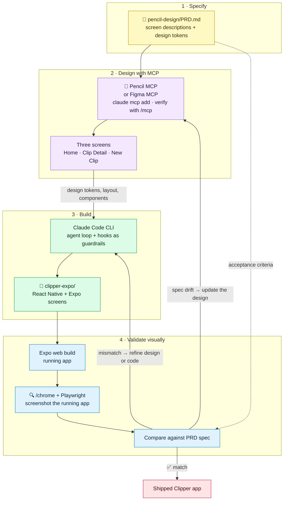
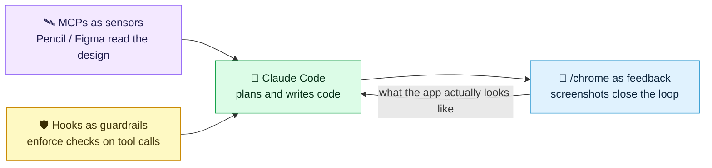

## Architecture

**Clipper** is a dark-themed code snippet manager for mobile, built to demonstrate a full design-to-code pipeline driven by a design MCP. A PRD defines three screens; Pencil (or Figma) MCP produces the designs; Claude Code generates the Expo/React Native implementation; and `/chrome` closes the loop by screenshotting the running app and comparing it back to the spec.



### The agentic engineering pattern



### Pipeline at a glance

| Phase | Input | Tool | Output |
| --- | --- | --- | --- |
| 1 · Specify | Product intent | `pencil-design/PRD.md` | Screen specs + design tokens |
| 2 · Design | PRD | Pencil MCP / Figma MCP | Home, Clip Detail, New Clip |
| 3 · Build | Design data via MCP | Claude Code CLI | `clipper-expo/` React Native screens |
| 4 · Validate | Running web build | `/chrome` + Playwright | Screenshot diff vs. spec → iterate |

### Repository layout

```
pencil-design/     Design phase — PRD.md and the Pencil/Figma MCP work
clipper-expo/      Code phase — pre-wired Expo app
```

Run `/repo` directory  from `pencil-design/` to launch the interactive wizard.
